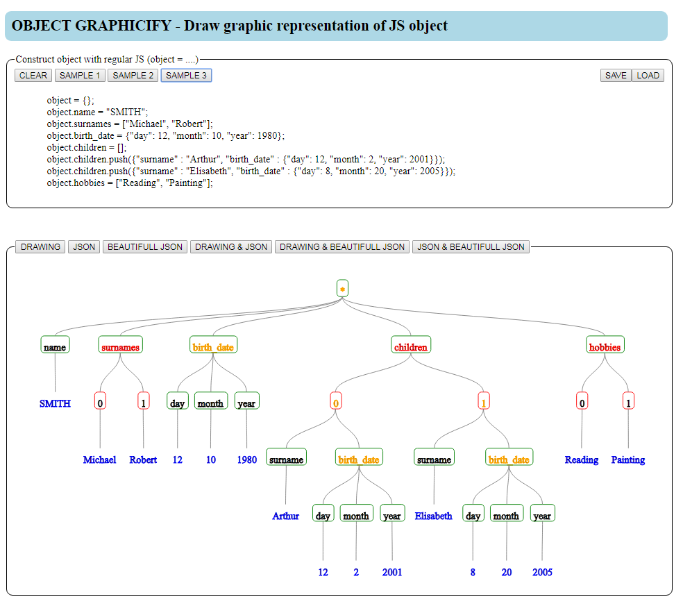

# Object Graphicify
This SPA draw a tree corresponding to an object you define with regular JS code 

* green frame : property
* red frame : index
* no frame : primitif

* orange text : object value
* red text : array value
* black text : primitif value
